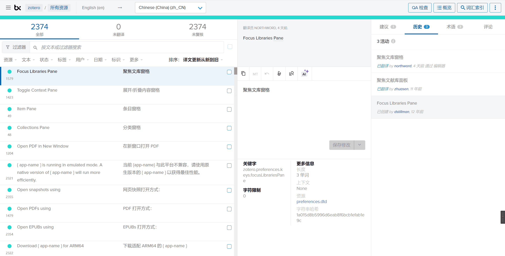
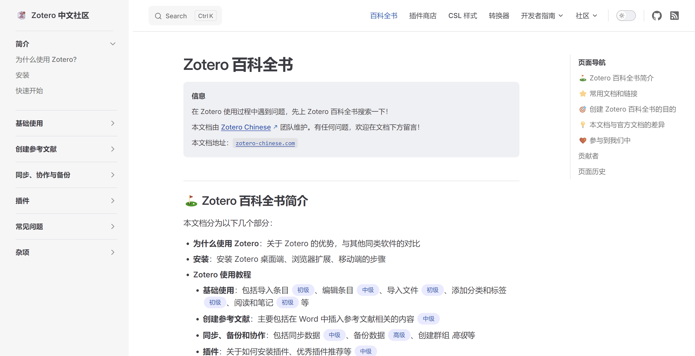
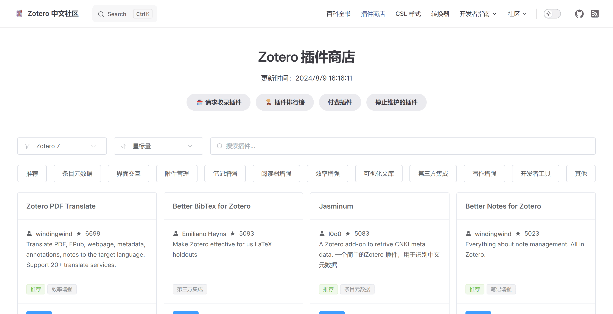
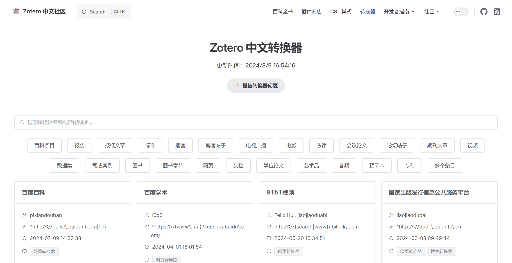
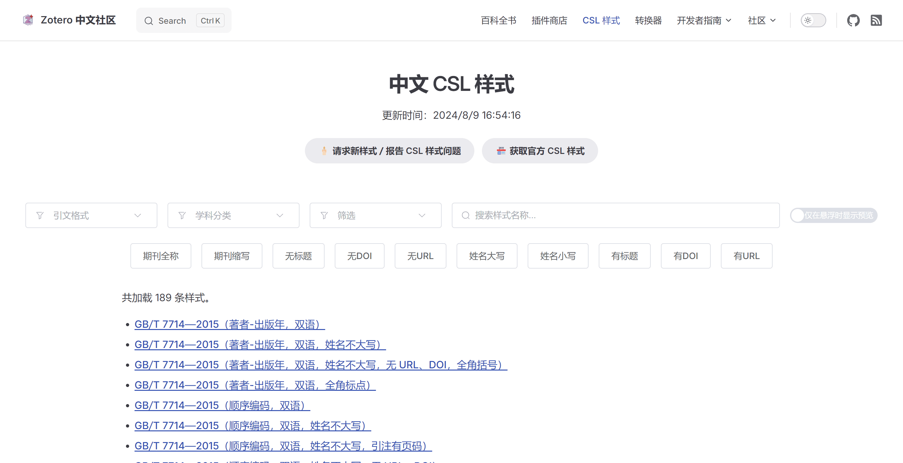

# Zotero 中文社区 - 新的征程

我们非常高兴 Zotero 官方团队终于推送了近年来最大的更新：Zotero 7！

这一全新版本不仅提升了用户体验，还引入了一系列强大的新功能，包括更快速的性能、更灵活的 PDF 注释工具以及对插件系统的重大改进。

不仅官方团队在更新核心代码，中文社区也在众多志愿者的帮助下，取得了众多成就。

## Zotero 7

- **全新的界面**：全新设计的界面，美观大方，同时支持深色模式。
- **更快的性能**：在大型数据库处理和启动速度上有显著提升，让研究更为流畅。
- **更好用 PDF 注释功能**：现在，你可以直接在 Zotero 中对 PDF 进行高亮、下划线和添加便签，所有注释内容都能轻松导出，方便后续整理和引用。
- **插件系统的优化**：新版 Zotero 提供了更强大的插件支持，使第三方开发者能够更灵活地扩展 Zotero 的功能，进一步提升工作效率。

::: tip

详细的变更请阅读 Zotero 的官方博文：[Zotero 7: Zotero, redesigned](https://www.zotero.org/blog/zotero-7/)。

:::

## 过去

过去一年，Zotero 中文社区在大家的支持下，取得了许多令人振奋的成果。

根据不完全统计，中文社区网站日均访问近万人次，其中大陆同学占比约 80%，港澳台同学占比约 10%。

### 🇨🇳 Zotero 的汉化

Zotero 中文社区一直积极参与 Zotero 的本地化翻译工作，通过 Transifex 平台，我们和其他翻译员共同为 Zotero 提供了完整的中文翻译，确保中文用户能够无障碍地使用和理解 Zotero 的各项功能。

### 📖 Zotero 百科全书

我们对中文用户手册进行了全面更新，涵盖了 Zotero 的基础操作、插件使用，以及常见问题的解决方案，帮助了众多中文用户顺利上手并解决了使用中的困惑。

在此，感谢所有为文档编辑做出贡献的同学！

### 🛠️ 插件商店页面

我们全新推出了插件商店页面，收录了大部分实用的 Zotero 插件，并且支持按功能、兼容性等多维度进行搜索、筛选和排序。页面还提供了多个下载镜像，方便国内用户快捷获取所需插件。

从去年九月起，到目前为止，插件商店页面已经服务近 73 万次，评价每天有两千余位同学使用插件商店页面，且在稳步上涨。

插件商店页面由 [@northword](https://northword.cn) 创建，感谢 [@l0o0](https://github.com/l0o0) 创建的表格格式的插件商店页面。

特别感谢 [@volatile-static](https://github.com/volatile-static) 维护的“插件排行榜”。

### 🔄 转换器列表页面

为了提方便同学们查询 Zotero 可以抓取哪些中文网站，我们推出了转换器列表页面。

这个页面列出了由中文社区维护的 Zotero 转换器，帮助用户了解 Zotero 支持抓取哪些中文网站，并极大地提高了文献管理的效率。

特别感谢 [@jiaojiaodubai](https://github.com/jiaojiaodubai) 和 [@l0o0](https://github.com/l0o0) 对转换器维护做出的贡献！

感谢 [@jiaojiaodubai](https://github.com/jiaojiaodubai) 对转换器页面的重大优化。

### 📑 中文 CSL 页面

我们还推出了支持中英双语排版的 CSL 样式页面，包含了包括国标及其变种样式在内的多种格式，并涵盖部分国内高校硕博论文、学术期刊的参考文献格式，为广大中文用户提供了更丰富的样式选择。

特别感谢 [@zepinglee](https://github.com/zepinglee) 和 [@redleafnew](https://github.com/redleafnew) 对中文 CSL 维护做出的贡献！

## 未来

随着 Zotero 7 的发布，Zotero 中文社区将继续致力于为用户提供优质的资源与支持：

- **持续维护百科全书**：我们将定期更新百科全书内容，移除已过时的介绍，并增加对新功能的详尽解析，确保用户能够及时获取到最新的使用指南。
- **更新插件商店**：插件商店页面现已默认显示支持 Zotero 7 的插件，我们计划在秋季学期开学前移除不再兼容 Zotero 7 的插件，确保用户能够无缝过渡到新版本。
- 更多更新敬请期待...

感谢每一位社区成员的支持与贡献！

Zotero 中文社区是我们共同努力的成果，期待在未来的日子里，继续与大家一起探索和推动 Zotero 在中文用户中的发展。让我们一同迎接 Zotero 带来的全新体验！🎉🚀
