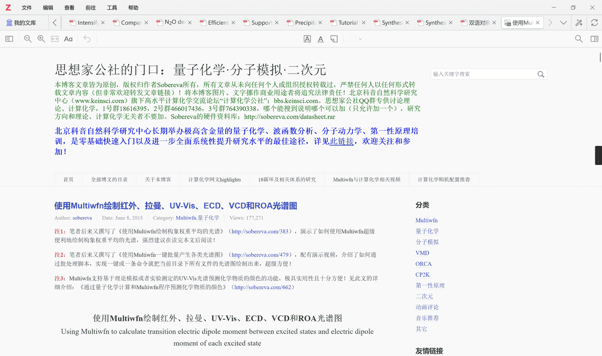
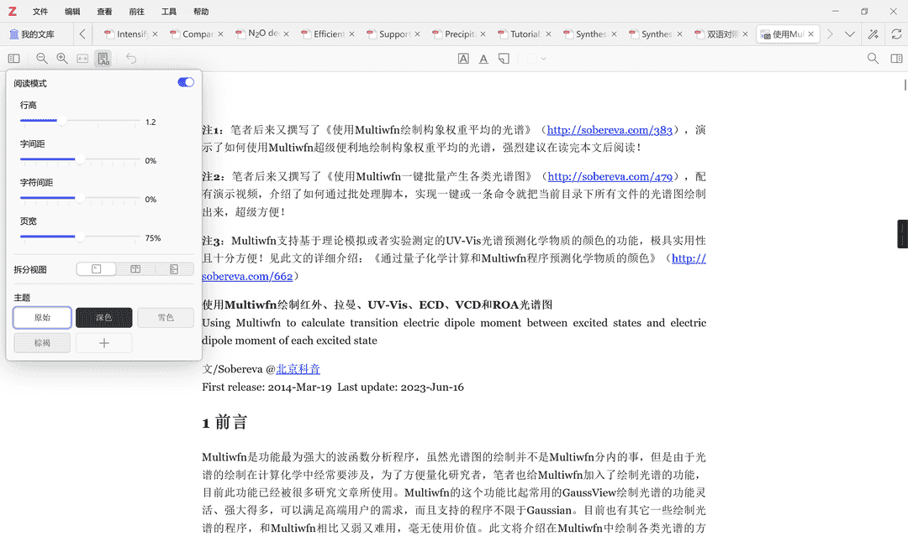

# Zotero 8 正式发布

::: tip

该博文翻译和改编自 Zotero 官方博客，原始链接为：[Zotero 8 - Zotero blog](https://www.zotero.org/blog/zotero-8/)

:::

各位 Zotero 用户，好消息！在 Zotero 7 带来视觉革新之后，备受期待的 **Zotero 8** 现已正式发布。本次更新不仅延续了新一代的设计语言，更在引用工作流、阅读体验和文件管理等核心功能上带来了重磅升级。

## 全新统一引用对话框：告别繁琐切换

Zotero 8 彻底重构了引用交互体验。全新的统一引用对话框整合了以往的「红框（快捷引用）」、「经典对话框」以及「添加笔记（黄框）」，实现了一体化操作。

- **双模式切换：** 提供 **列表模式（List mode）** 实现全库秒搜，以及 **库模式（Library mode）** 方便在特定分类中点选，两者可一键无缝切换。
- **定位符快捷输入：** 选中条目后，现在直接在搜索栏输入 `line 10` 或 `l. 10`（其他定位符也可以）即可快速添加定位符。
- **笔记与引用联动：** 在对话框左下角即可快速切换添加引用或笔记。

（对于习惯经典对话框的用户请注意：新界面没有用于手动编辑引用的文本字段。多年来，直接在文档中编辑引用一直是可行的，这也是为什么「红框」对话框没有包含此类文本框的原因。更重要的是，在几乎所有情况下都应避免此类手动编辑。相反，应通过引用对话框 [自定义引用](https://www.zotero.org/support/word_processor_plugin_usage#customizing_cites)，这样 Zotero 才能在按需继续自动更新引用。）

## 条目列表直显注释：文献阅读一目了然

现在，你在 PDF、EPUB 或网页快照中添加的所有注释，都会直接显示在条目列表中对应附件的下方。

- **注释级搜索：** 你可以通过「高级搜索」搜索特定的注释内容或标签，甚至可以直接将选中的注释拖拽生成笔记，或者通过「快速复制」粘贴到外部编辑器。
- **管理更高效：** 支持直接给注释打标签，并在右侧条目面板中按层级预览。

## 护眼模式与自定义主题：打造你的专属阅读器

阅读器新增了独立的外观面板，终于支持了大家呼吁已久的阅读主题功能。

- **内置与自定义主题：** 除了自带的深色（Dark）、雪白（Snow）、羊皮纸（Sepia）主题，你还可以通过自定义前/背景色创建专属配色。
- **更智能的深色模式：** 告别过去生硬的图片反色。新版深色主题会智能微调图像亮度和扫描件背景，保护视力的同时保留图片原貌。
- **更广泛的文件支持：** 现在 Zotero 8 也将尝试对扫描件（整页图像的 PDF）应用主题

视图设置是针对单个文档的。主题则是全局应用于所有文档（包括条目面板中的附件预览），并适用于 PDF、EPUB 和网页快照。

> [!NOTE]
> Zotero Style 插件先前提供了这个功能，随着 Zotero 8 的发布，Style 插件将逐步移除该功能。

## 笔记标签页：沉浸式记笔记体验

现在除了在独立窗口中打开笔记外，还可以将其在标签页中打开。笔记标签页填满整个窗口，拥有更宽的页边距以提高可读性，并为记笔记提供简洁、无干扰的空间。

默认情况下，双击条目列表中的笔记将在标签页中打开。你可以通过右键菜单选择在其他空间打开，也可以在设置的「常规」面板中更改默认行为（「在窗口而非标签页中打开笔记」）。

标签页中的笔记在「查看」菜单中有独立的字体大小设置。

> [!NOTE]
> Zotero Better Notes 插件先前提供了这个功能，现在 Zotero 8 已经官方支持该功能了！

## 网页快照「阅读模式」：网页从此变清爽

网页快照功能现在支持**阅读模式（Reading Mode）**。它可以自动剔除网页上的无关广告和干扰元素，重新排版文字，并允许你调节行高和字体，让网页文献读起来像电子书一样舒服。

| 原始网页                             | 启用阅读模式                         |
| ------------------------------------ | ------------------------------------ |
|  |  |

## 标签页管理大升级：键盘党福音

Zotero 8 重新设计了标签页菜单，使其通过键盘交互变得更快。

你现在可以随时按 `Ctrl/Cmd-;` 调出该菜单。

菜单打开后，它可以同时接受搜索输入、上下导航和行选择，无需在菜单的不同部分之间切换。你只需开始输入已打开标签页的名称，缩小列表范围后按回车键即可切换。

还可以通过上下移动到行关闭按钮并按空格键来快速关闭多个标签页。

## 持续文件重命名：告别手动同步和 ZotFile 插件

这是一个非常实用的改进：Zotero 现在支持**持续自动重命名**。每当你修改条目的元数据（如标题、年份）时，附件的文件名会自动随之更新。再也不用频繁右键点击「根据父条目元数据重命名」了。

> [!NOTE]
> 升级后，旧有文件不会被强制修改，你可以在「设置」中选择是否一键重命名现有文件。

你可以在 Zotero 设置的「常规」选项卡中配置重命名适用于哪些文件类型。

「根据父条目元数据重命名文件」已从条目右键菜单中移除。如果文件名与配置的格式不匹配（例如因为禁用了自动重命名，或者你更改了格式但未选择重命名所有文件），你可以点击附件条目面板中文件名旁边的「重命名文件以匹配父条目」按钮来重命名。

### 附件命名逻辑大重构：告别冗余，回归简洁

很多用户反馈，为什么附件在列表中显示为「Full Text PDF」或「Preprint PDF」，而不是长长的文件名？Zotero 8 进一步明确并优化了这一逻辑：

- **标题与文件名的解耦：** Zotero 将「附件标题（显示在列表里）」与「磁盘文件名」分开处理。由于父条目已经显示了标题、作者等信息，附件标题若再重复一遍文件名会显得列表非常臃肿。因此，Zotero 现在会默认使用「PDF」、「Ebook」等简洁标题，而将完整的元数据保留在磁盘文件名中。
- **附件标题规范化（Normalize Titles）：** 如果你的库里有很多早期版本遗留下的、标题和文件名一样长的「乱码」附件，Zotero 8 在 `工具` → `管理附件` 中新增了**「规范化附件标题」**功能，可以一键将它们改回清爽的「PDF」等简洁形式。
- **支持显示文件名：** 这是一个重要的妥协与进步。如果你确实习惯在列表中直接看到完整的文件名（类似旧版 ZotFile 的效果），现在可以在 「设置」->「常规」 面板中勾选「在条目列表中显示附件文件名」，将控制权交还给你。
- **智能识别附件类型：** 对于从网页抓取的文献，它会智能命名为「ScienceDirect Full Text PDF」等；而对于你手动拖入的补充材料（如实验数据），它仍会保留原始文件名作为标题，方便你区分。

> [!TIP]
> 过去很多用户习惯手动执行「根据父条目重命名文件」，其实是为了让列表里的标题变好看。在 Zotero 8 中，重命名是**全自动且持续**的，而标题则保持简洁。我们建议大家尝试一下这种「新逻辑」，它能让你的文献库看起来整洁得多！

## ARM Linux 支持

Zotero 8 增加了适用于 ARM64 设备运行的 Linux 版本。这包括基于 ARM 的 Chromebook、运行 Linux 的 Apple Silicon Mac（Linux 虚拟机、Asahi Linux）以及树莓派（Raspberry Pi）。

如果你之前无法在 ARM 设备上运行 Zotero，或者一直在模拟运行 x86_64 版本，不妨尝试一下。

## 用户界面改进

我们针对常用需求对界面进行了多项改进：

- 库选项卡中的新按钮允许你快速关闭条目面板，无需拖动边缘或使用菜单。
- 你可以通过在侧边导航栏中拖动图标来重新排序条目面板的部分。
- 可以将条目、分类和搜索结果拖入回收站。
- 可以从条目面板中拖动附件、笔记和关联条目（例如将文件复制到文件系统或使用快速复制）。
- 拖动到分类上方时，分类会自动展开，更方便将分类或条目放入子分类。
- 可以从条目面板删除附件。
- 标签页在关闭时会保持大小，以便快速连续关闭多个标签页。

## Zotero Connector 标签自动补全和笔记字段

配合 Zotero 8，Zotero Connector 的保存弹窗可以自动补全 Zotero 库中的标签，并允许你在保存条目时添加笔记。

## 新增条目字段

Zotero 8 添加了大量新的字段和创作者类型，如：

- 每种条目类型均包含 DOI，例如「图书」，「学位论文」等
- 期刊文章包含 PMID 和 PMCID
- 书籍包含 Original Place、Original Publisher 和 Original Date
- 网页和期刊/报纸/杂志文章包含Publisher 和 Place
- 多种类型包含 Place 字段
- 多种类型包含 Creator（等同于 Author）字段

先前存储在「额外 Extra」字段里的相关字段会被自动迁移到新的内置字段上。

请参阅：[New item fields](https://forums.zotero.org/discussion/121656/coming-soon-new-item-fields/p1)

## 更多内容

Zotero 8 包含的内容远不止这里列出的这些。详情请参阅 [更新日志](https://www.zotero.org/support/8.0_changelog)。

## 系统要求

Zotero 8 需要 macOS 10.15 或更高版本、Windows 10 或更高版本，或 [兼容 Firefox 140](https://www.firefox.com/en-US/firefox/140.0/system-requirements/#gnulinux) 的 Linux 系统。

## Zotero 迈入「小步快跑」时代：版本发布全面加速

以往 Zotero 的重大更新（如 Zotero 6 到 Zotero 7）往往需要一年多的开发与等待。从现在起，官方将正式改变版本管理策略，进入**快速迭代周期**：

- **每 6-10 周发布一个新版本：** 以后不再需要等待数月甚至一年才能见到新功能。官方计划每 1.5 到 2.5 个月就推出一个新版本（如 Zotero 9、Zotero 10 等），只要功能开发成熟，就会立刻推送到稳定版。
- **更快的反馈速度：** 这意味着新功能将更早普及，而 Bug 修复也将不再受限于「重大版本更新」，修复响应将更加迅速。
- **Beta 用户建议：** 官方建议，如果你之前是为了提前体验新功能而被迫使用 Beta 版（内测版），现在可以考虑切换回**稳定版**了。因为随着发布频率的提高，稳定版很快就会跟上最新的功能。
- **日常维护不中断：** 在两个功能版本（如 Zotero 8 和 9）之间，官方仍会持续发布类似 Zotero 8.0.1 这样的维护更新，专门用于修复 Bug 和细节微调。

Zotero 正在变得越来越像现代主流浏览器，通过更短、更可预测的更新周期，让每一位研究者都能第一时间享受到技术进步带来的便利。

了解 [Zotero 的新发布周期](https://www.zotero.org/blog/a-faster-release-cycle-for-zotero/)

## 获取 Zotero 8

如果你正在运行 Zotero，可以通过「帮助」 → 「检查更新…」进行升级。

还没有 Zotero？[立即下载 Zotero 8](https://www.zotero.org/download/)。

## 中文社区更新情况

目前，中文社区的的插件商店还没有完全核实插件是否适配了 Zotero 8，同学们查找插件时候，可以按 Zotero 7 版本的先下载，没有适配的话会提示「不兼容」。

使用手册部分也有待更新的板块，尤其是「在 Word 中插入参考文献」小节和「阅读」小节，我们欢迎热心同学帮忙完善更新百科全书！

## 插件适配情况

Zotero 8 beta 版本发布至今已经接近一年了，截止到目前，主流插件如翻译、Better Notes、茉莉花、Better BibTex、Linter、Style等插件都已经完成了适配。仍为完成适配的插件有一定概率其作者已经不再积极维护，我们建议同学们根据自身情况选择放弃一些插件的能力。

## 已知问题

### Edge 浏览器上的 Zotero Connector 无法工作

有用户报告 Edge 浏览器上的 Zotero Connector 无法抓取条目，经过 Zotero 官方调查，这是 Edge 更新导致的，Zotero 团队已经提交了更新，此问题已经修复，请参阅：[Zotero extension not working after Edge update](https://forums.zotero.org/discussion/129161/zotero-extension-not-working-after-edge-update#latest)。
